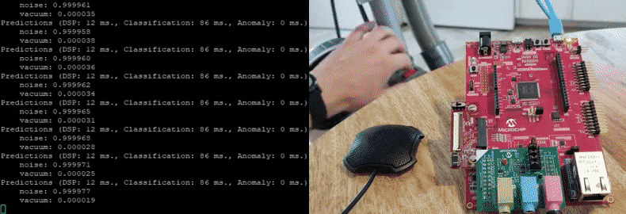

# Sound Event Detection with Edge Impulse

## Overview
This repository is a companion to the [Sound Recognition with Edge Impulse
tutorial](https://microchipdeveloper.com/machine-learning:soundrecognition-with-edge-impulse)
on the Microchip Developer website; it contains the firmware to classify between vacuum cleaner sound and background noise on a [SAME54 Curiosity
Ultra](https://www.microchip.com/DevelopmentTools/ProductDetails/PartNO/DM320210)
development board +
[WM8904](https://www.microchip.com/Developmenttools/ProductDetails/AC328904)
audio daughterboard, as well as some code for creating a custom processing block with Edge Impulse.

## Benchmarks
Measured with ``-O2`` compiler optimizations and 120MHz Clock
- 144kB Flash
- 76kB RAM
- 98ms Inference time
- 96.9% Test set accuracy (see section on [Audio Dataset](#audio-dataset))

## Audio Dataset
A dataset for vacuum cleaner detection can be downloaded from the [releases page](releases). The data is a selected subset of the [DEMAND](https://zenodo.org/record/1227121#.XRKKxYhKiUk) and [MS-SNSD](https://github.com/microsoft/MS-SNSD), with the vacuum cleaner sounds pulled from MS-SNSD, and the background noise segments (babble noise, air conditioner, and a mix of indoor domestic noise) pulled from both DEMAND and MS-SNSD.

## LogMFE Custom Processing Block
Code for adding LogMFE audio features to Edge Impulse Studio is located under the [custom-processing-blocks](custom-processing-blocks) directory.
